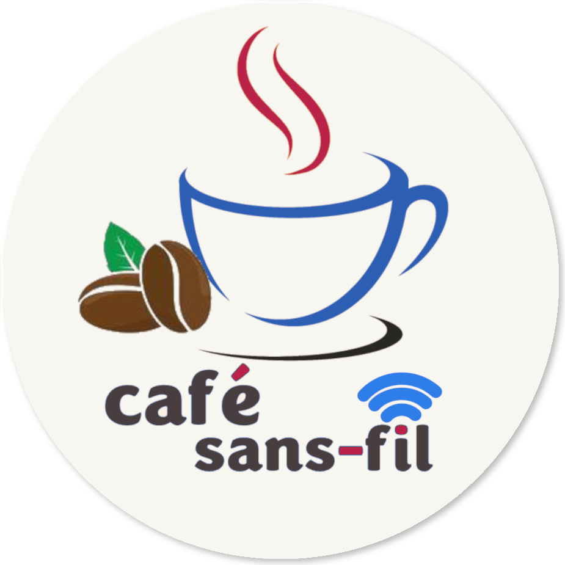

 
 

  

 

# Café sans-fil

Après la création de la plateforme web Café-Sans permettant aux étudiants de l'Université de Montréal (UdeM) de voir les menus des
cafés sur les différents campus de l'université lors des sessions précédentes, cette session (été 2024), nous devons développer une
application mobile qui permettra la gestion des bénévoles et des employés des différents cafés sur le campus. Elle permettra aussi aux
gérants de gérer leurs stocks et les événements prévus dans les cafés.Enfin, cette application permettra aussi aux bénévoles de consulter et choisir leurs horaires de travail.

## 📋 Besoins fonctionnels

### Gerant

- [ ] **Gestion D'evenement**
  - [ ]  Voir les événements
  - [ ]  Voir les horaires du café
  - [ ]  Ajouter un événement
  - [ ] Retirer un événement
  - [ ] Enregistrer des événements dès qu'ils sont épinglés dans la boîte mail
- [ ] **Gestion des stocks**
  - [ ]  Enregistrer les nouveaux produits dans le système de la plateforme via des factures d'achat
  - [ ]  Suivre en temps réel des entrées et sorties de stock, y compris les ventes, les réapprovisionnements et les pertes éventuelles
  - [ ]  Suivre en temps réel des entrées et sorties de stock, y compris les ventes, les réapprovisionnements et les pertes éventuelles
- [ ] **Tableau de bord**
  - [ ] Consulter le tableau de bord personnalisable offrant différentes métriques (niveaux de stock actuels, ventes quotidiennes, hebdomadaires et mensuelles, bénéfices nets)
  - [ ]  Consulter des Graphiques et visualisations intuitives
- [ ] **Gestion des bénévoles**
  - [ ] Attribuer des rôles et des autorisations spécifiques aux bénévoles
  - [ ] Créer et modifier la planification hebdomadaire
  - [ ] Ajouter un bénévole à l'horaire
  - [ ] Retirer un bénévole de l'horaire
  - [ ] Communiquer avec les bénévoles
### Bénévole:
  - [ ] Voir son horaire
  - [ ] Clock In
  - [ ] Choisir une heure
  - [ ] Voir les autre bénévoles
  - [ ] Communiquer avec les bénévoles
  - [ ] **Gestion des stocks**
    - [ ]  Enregistrer les nouveaux produits dans le système de la plateforme via des 
  
## 📋 Besoins non-fonctionnels
  - [ ] Utilisabilité : Concevoir une interface utilisateur conviviale et intuitive pour une prise en main rapide par le gérant et les bénévoles.
  - [ ] Portabilité : Développer l'application de manière à ce qu'elle soit compatible avec différentes plateformes et systèmes d'exploitation, tels Android et iOS.
  - [ ] Sécurité : Garantir que les informations confidentielles, telles que les données financières et les horaires des bénévoles, sont protégées contre tout accès non autorisé.
  - [ ] Fiabilité : Effectuer des sauvegardes régulières des données pour garantir leur intégrité et leur disponibilité en cas de besoin.
  - [ ] Maintenabilité : Concevoir l'application avec des modules indépendants et bien définis pour faciliter les modifications et les ajouts futurs sans impact sur le reste du système.

- [ ] **Authentification et profil**
  - [ ] Créer un compte
  - [ ] Modifier mon profil

## 🌐 Infrastructure

### 🗄️ Base de données

- [**MongoDB**](https://www.mongodb.com/): Base de données NoSQL orientée document.

### 🔗 API

- [**NodeJs**] (https://nodejs.org/en): module de developpement API
- [**ExpressJs**] (https://expressjs.com): module faciltant le developpement des API

### 💻 Application Mobil

- [**Flutter**](https://flutter.dev): Librairie develeppe par Google facilitant la creation des applications cross platform

# 📘 Documentation

<!-- 🔗 [Guide d'utilisation](https://github.com/ceduni/cafe-sans-fil/wiki/Base-de-donn%C3%A9es-(BD))  -->

# 🗂️ Organisation

Les dossiers du répertoire sont organisés comme suit:

- `\back`: contient le code source du backend composé de l'API et de la base de données
- `\front`: contient le code source de l'application web
- `\docs`: contient le site web du projet

# 🌟 Contribution

Si vous êtes intéressé à participer au projet, veuillez prendre contact avec [Louis-Edouard LAFONTANT](mailto:louis.edouard.lafontant@umontreal.ca).

## Contributeurs

- Louis-Edouard LAFONTANT [@lelafontant](https://github.com/lelafontant)
- Johann SOUROU [@JohannSR28](https://github.com/JohannSR28)
- Larry Fotso Guiffo [@larry1473](https://github.com/larry1473)

